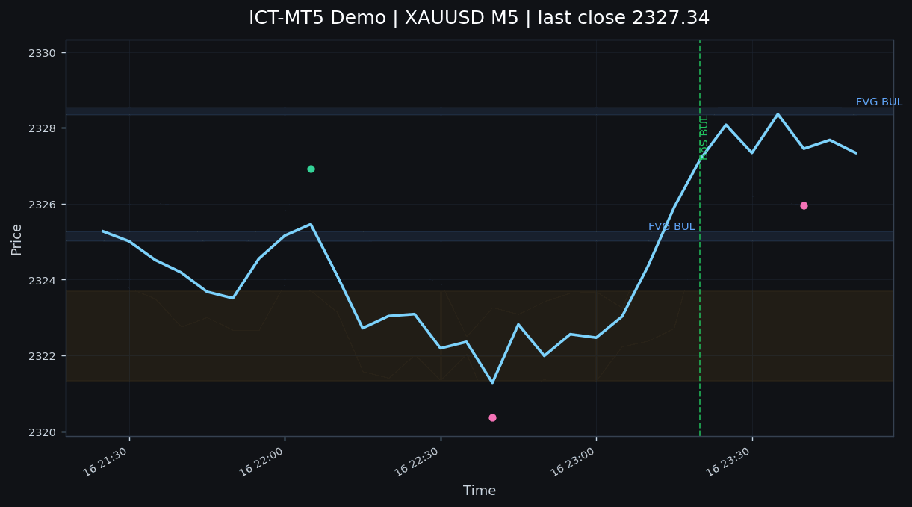

# ICT-MT5 — Automated ICT Smart Money Concepts EA

> **Author:** Malibongwe Ndhlovu  
> **GitHub:** [MB-Ndhlovu](https://github.com/MB-Ndhlovu)  
> **License:** MIT  
> **Markets:** XAUUSD · NAS100 · US30  
> **Risk:** 1% per trade | Daily Cap: -2%  

---

## What This Project Is

An automated trading system based on **ICT (Inner Circle Trader)** methodology — also known as **Smart Money Concepts (SMC)**. The EA runs on **MetaTrader 5 (MQL5)** and implements the core ICT concepts:

| Concept | Description |
|---|---|
| **Market Structure** | Break of Structure (BoS) vs Change of Character (ChoCh) |
| **Order Blocks** | Institutional footprint zones where banks place large orders |
| **Fair Value Gaps** | 3-candle imbalances — unfilled institutional orders |
| **Liquidity Pools** | Buy-Side Liquidity (BSL) & Sell-Side Liquidity (SSL) — stop clusters |
| **Kill Zones** | High-probability time windows (London Open, NY Open) |
| **PD Array** | Fibonacci-based Premium/Discount zone matrix |

---

## Project Structure

```
ICT-MT5/
├── README.md
├── CHANGELOG.md
├── LICENSE
├── AGENTS.md
├── PROJECT_PLAN.md
├── docs/
│   ├── DEMO_REPORT.md
│   ├── PITCH.md
│   └── ict-demo.gif
├── scripts/
│   └── demo_generator.py
├── Experts/
│   └── ICT_EA.mq5              ← Main Expert Advisor
├── Include/
│   ├── ICT_MarketStructure.mqh ← ✅ BoS/ChoCh detection
│   ├── ICT_OrderBlocks.mqh     ← ✅ Institutional order blocks
│   ├── ICT_FairValueGap.mqh     ← ✅ FVG detection
│   ├── ICT_LiquidityPools.mqh  ← ✅ BSL/SSL pools
│   ├── ICT_KillZones.mqh       ← ✅ Session timer
│   ├── ICT_PDArray.mqh         ← ✅ Premium/Discount matrix
│   ├── ICT_RiskManager.mqh      ← ✅ Position sizing + drawdown
│   └── ICT_SignalGenerator.mqh  ← ✅ Entry signal aggregator
```

---

## Markets & Timeframes

| Symbol  | Timeframe | Lookback | Notes |
|---------|-----------|----------|-------|
| XAUUSD  | M5        | 3–5 bars | High noise; wider stops needed |
| NAS100  | H1        | 8–12 bars| Slower structure; cleaner signals |
| US30    | H1        | 8–12 bars| Correlates with DXY and SPX |

**Recommended:** Run on VPS for 24/5 execution. Local machine tested and supported.

---

## Core Modules

### 1. ICT_MarketStructure.mqh
Detects swing highs/lows and classifies market structure state.
- **State:** Bullish / Bearish / Neutral
- **Events:** BoS (trend continuation) · ChoCh (trend reversal)
- **Method:** Pivot-window detection (no repainting)
- **Confirmation:** 2+ directional bars after structure break

### 2. ICT_OrderBlocks.mqh
Identifies institutional order block zones.
- **Bullish OB:** Last bearish candle before a strong bullish impulse
- **Bearish OB:** Last bullish candle before a strong bearish impulse
- **Trade:** Entry on retest of OB zone; invalidation beyond the block

### 3. ICT_FairValueGap.mqh
Detects 3-candle imbalance zones (unfilled institutional orders).
- **Bullish FVG:** Gap between candle 1 high and candle 3 low (with overlap)
- **Bearish FVG:** Gap between candle 1 low and candle 3 high
- **Trade:** Entry on gap fill retest; target next liquidity pool

### 4. ICT_LiquidityPools.mqh
Marks and tracks liquidity zones (stop clusters).
- **BSL (Buy-Side Liquidity):** Swing highs above structure
- **SSL (Sell-Side Liquidity):** Swing lows below structure
- **Sweep Detection:** Identifies when price hunts stop orders before reversing
- **Trade:** Entry after sweep confirmation; stop beyond the pool

### 5. ICT_KillZones.mqh
High-probability session windows.
| Session | NY Time | London Time (SAST) | Probability |
|---------|---------|---------------------|-------------|
| London Open | 03:00–05:00 | 10:00–12:00 | High |
| NY Open | 07:00–10:00 | 14:00–17:00 | Highest |
| London Close | 08:00–10:00 | 15:00–17:00 | Moderate |

### 6. ICT_PDArray.mqh
Premium/Discount zone matrix + Fibonacci confluence.
- **Discount Zone:** Below 50% Fib retrace of daily range (buy side)
- **Premium Zone:** Above 50% Fib retrace of daily range (sell side)
- **OTE (Optimal Trade Entry):** 62–79% retracement after BoS
- **Imbalance:** Combines 8 trigger tools into ranked entry confidence

### 7. ICT_RiskManager.mqh
Position sizing and drawdown control.
```cpp
LotSize = (AccountEquity × RiskPercent) / (StopLossPips × PipValue)
```
- **Risk per trade:** 1% (fixed)
- **Daily loss cap:** -2% → EA halts for the day
- **Max consecutive losses:** Triggers review after 5 losses

### 8. ICT_SignalGenerator.mqh
Aggregates all modules into ranked entry signals.
- **Confidence Score:** 0–100 (composite of all modules)
- **Entry conditions:** 6-rule checklist must ALL be true
- **Output:** ENUM_SIGNAL { SIGNAL_NONE, SIGNAL_BUY, SIGNAL_SELL }

---

## Entry Checklist (ALL must be TRUE for BUY)

1. ✅ Daily Bias = Bullish
2. ✅ Price in Discount Zone (below Fib 50%)
3. ✅ Liquidity sweep detected (SSL taken on the sweep)
4. ✅ 15M/5M: Bullish BoS or ChoCh confirmed
5. ✅ Kill Zone window active
6. ✅ Bullish FVG or Bullish OB at current price

---

## Installation

1. **Clone the repository:**
```bash
git clone https://github.com/MB-Ndhlovu/ICT-MT5.git
```

2. **Copy to MT5:**
- Copy all `.mqh` files → `MT5/MQL5/Include/`
- Copy `ICT_EA.mq5` → `MT5/MQL5/Experts/`
- Restart MetaTrader 5

3. **Load the EA:**
- Open MT5 → Navigator → Experts → Drag `ICT_EA` onto a chart
- Set inputs for symbol, risk, and Kill Zone preferences

---

## Configuration Inputs

| Input | Default | Description |
|---|---|---|
| `ICT_Symbol` | XAUUSD | Trading symbol |
| `ICT_RiskPercent` | 1.0 | Risk per trade (%) |
| `ICT_MaxDailyLoss` | 2.0 | Daily loss cap (%) |
| `ICT_Lookback` | 5 | Swing detection lookback |
| `ICT_KillZoneLondon` | true | Enable London Kill Zone |
| `ICT_KillZoneNY` | true | Enable NY Kill Zone |
| `ICT_UseHigherTFFilter` | true | Require D1 bias confirmation |

---

## Backtesting

Use the EA directly in the MT5 Strategy Tester with XAUUSD M5, NAS100 H1, or US30 H1. The repository now includes the demo pipeline in `scripts/demo_generator.py` and the generated walkthrough in `docs/DEMO_REPORT.md`.

---

## Demo



See `docs/DEMO_REPORT.md` for the generated XAUUSD M5 walkthrough and signal summary.

---

## Contributing

This is a portfolio project for learning and demonstration. Contributions welcome:
1. Fork the repo
2. Create a feature branch
3. Submit a pull request with test results

---

## Disclaimer

**This is not financial advice.** This EA is for educational and portfolio purposes only. Algorithmic trading carries substantial risk of loss. Always backtest thoroughly before using on a live account.